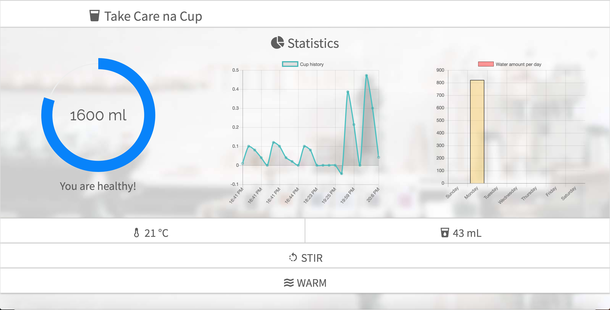
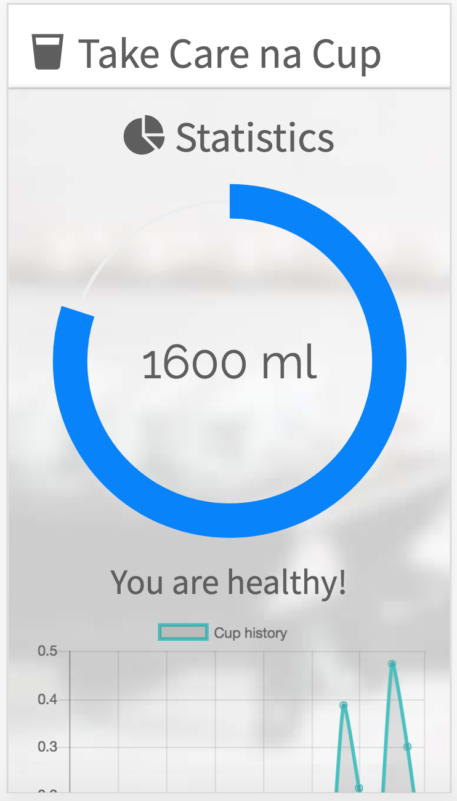
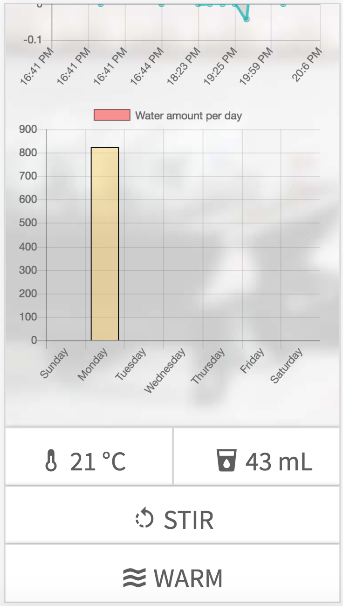

# Take Care na Cup Front-end
> eXceed Camp 14 Project<br>Theme: Make It Happen

Front-end website created using HTML + CSS (Bootstrap) + Javascript (jQuery).

Available on: https://takecarenacup.herokuapp.com/


<div>


</div>

## Build Setup

``` bash
# install dependencies
npm install

# serve with hot reload at localhost:8080 (using nodemon)
npm run dev

# build for production with minification
npm run build
```
## References

Full project description: http://exceed.cpe.ku.ac.th/wiki/index.php/Exceed_14_Group_8
Backend:  https://github.com/srakrn/Exceed-TakeCarenaCup-Backend
<br>
Arduino: https://github.com/srakrn/Exceed-TakeCarenaCup-Arduino
